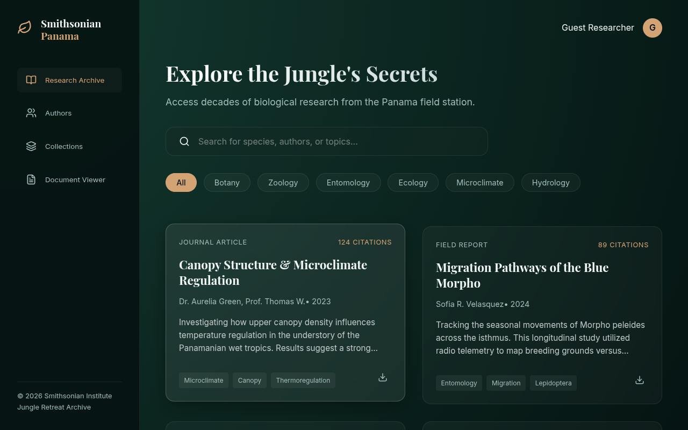

# Panama Research Ingest — Jungle Retreat Archive

A React + Vite archive UI for a Smithsonian Panama–themed research collection. Browse research records, authors, and collections with search and tag filters, and ingest new papers through the SuperDoc-powered document viewer (upload a `.docx`, fill in metadata, submit). The research data is demo data in `src/data.js`.

## Run

```bash
npm install
npm run dev       # dev server
npm run build     # production build (dist/)
```

## Note on the live site

The GitHub Pages deploy currently serves the raw Vite source, so the app doesn't render there — Pages would need the built `dist/` output instead. The screenshot below is from a local production build:

**Live:** https://mvvk-space.github.io/panama-research-ingest/


